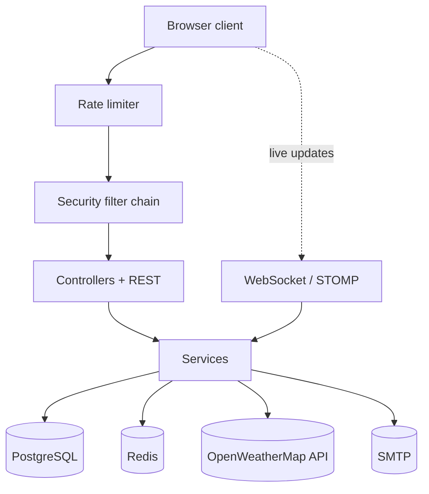
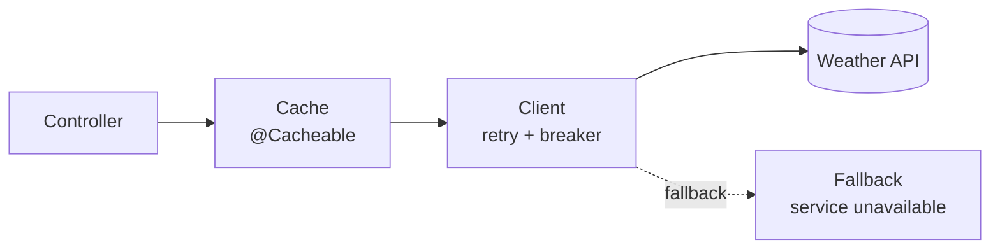
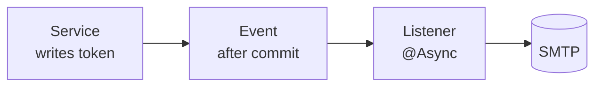

<p align="center">
  
</p>
<h1 align="center">WeatherViewer</h1>

<p align="center"><strong>A Spring Boot web app for tracking weather and forecasts across your favorite locations.</strong></p>
<p align="center">
  
  
  
  
  
  <a href="https://github.com/podlLev/WeatherViewer/actions/workflows/ci.yml"></a>
  
</p>

<p align="center">
  <a href="#overview">Overview</a> ·
  <a href="#features">Features</a> ·
  <a href="#tech-stack">Tech Stack</a> ·
  <a href="#architecture">Architecture</a> ·
  <a href="#getting-started">Getting Started</a> ·
  <a href="#api-documentation">API Docs</a> ·
  <a href="#observability">Observability</a> ·
  <a href="#security">Security</a> ·
  <a href="#running-tests">Testing</a> ·
  <a href="#ci-cd">CI/CD</a> ·
  <a href="#project-structure">Structure</a>
</p>

---

## Overview

WeatherViewer is a personal weather dashboard for tracking the places you care about. Sign up, verify your email, search for any city, and save it — your dashboard then shows current conditions for every saved location at a glance, with hourly and daily forecasts just a click away, in the units you prefer. Mark your most-checked spots as favorites to keep them front and center. Live weather and location data come from the OpenWeatherMap API, calls to which are cached and protected by retries and a circuit breaker, so a flaky upstream doesn't take your dashboard down with it.

## Features

- **Authentication** — sign-up and sign-in with Spring Security, BCrypt password hashing, and role-based access (`USER` / `ADMIN`)
- **Email verification & password reset** — new accounts are confirmed via an emailed verification link, and a self-service "forgot password" flow lets users reset their password with an expiring token
- **Remember-me** — persistent-token "remember me" on sign-in, so sessions survive a browser restart
- **Account lockout** — an account is temporarily locked after repeated failed sign-in attempts, protecting it against brute-force guessing
- **Location search** — look up cities by name via the OpenWeatherMap Geocoding API and save them to your account, up to a configurable per-user limit
- **Dashboard** — view current weather for all saved locations, sortable by date added, name, or favorite status; if one location's weather fails to load, the rest of the dashboard still renders
- **Favorites** — mark/unmark locations as favorites and filter the dashboard to show only those
- **Forecasts** — hourly and daily forecast views for any saved location
- **Unit preference** — choose metric or imperial units on your profile; all displayed weather and forecast values are converted accordingly
- **Dark mode** — a light/dark theme toggle, remembered across pages
- **User profile** — update account details and preferences from a dedicated profile page
- **REST API** — JSON endpoints for users, locations, and weather data, documented with OpenAPI/Swagger, with pagination on the admin list endpoints
- **Caching** — weather, forecast, and geocoding responses are cached (Redis in production, in-memory for local/dev) to reduce external API calls
- **Resilience** — retries with exponential backoff and a circuit breaker (Resilience4j) around every call to the OpenWeatherMap API
- **Rate limiting** — per-route request limits on sign-in, sign-up, and the REST API, safe against `X-Forwarded-For` spoofing and skipping static assets
- **Database migrations** — schema is version-controlled and applied automatically via Liquibase
- **Observability** — Actuator health/liveness/readiness probes and Prometheus metrics exposed on a separate management port, plus request correlation IDs in logs
- **Hardened by default** — strict Content-Security-Policy, secure/`SameSite=Strict` session cookies, a single concurrent session per user, and a non-root container image

## Tech Stack

| Layer            | Technology                                                                                 |
|:-----------------|:-------------------------------------------------------------------------------------------|
| Language         | Java 17                                                                                    |
| Framework        | Spring Boot 3.5 (Web, Security, Data JPA, Validation, Cache, Mail, Actuator)               |
| Templating       | Thymeleaf                                                                                  |
| Database         | PostgreSQL                                                                                 |
| Migrations       | Liquibase                                                                                  |
| Caching          | Redis (Spring Cache)                                                                       |
| Resilience       | Resilience4j (retry + circuit breaker)                                                     |
| Mapping          | MapStruct                                                                                  |
| Mail             | Spring Mail (SMTP) — email verification and password reset                                 |
| API docs         | springdoc-openapi (Swagger UI & Scalar)                                                    |
| Observability    | Spring Boot Actuator (health/liveness/readiness), Micrometer + Prometheus, correlation IDs |
| Build tool       | Maven                                                                                      |
| Testing          | JUnit, Spring Boot Test, Spring Security Test, H2 (in-memory test DB), JaCoCo (coverage)   |
| Containerization | Docker, Docker Compose (non-root runtime image)                                            |
| CI/CD            | GitHub Actions (build/test, coverage, Docker Hub image push)                               |
| External API     | [OpenWeatherMap](https://openweathermap.org/api) (current weather, forecast, geocoding)    |

## Architecture

**System overview** — the app sits between the browser and four external dependencies. Every HTTP request passes through the rate limiter and the security filter chain before reaching a controller; live dashboard/forecast updates instead flow over a persistent WebSocket connection, pushed on a schedule rather than requested:



Postgres holds users, locations, and tokens (schema managed by Liquibase). Redis backs both the rate limiter's fixed-window counters and the weather/forecast/geocoding cache. The two flows below zoom into the parts of this picture that need to tolerate a flaky dependency: weather reads and outbound mail.

Two request paths matter most for reliability: reads that hit the OpenWeatherMap API, and emails triggered by account actions. Both are built so a slow or failing dependency degrades gracefully instead of taking the app down with it.

**Weather read path** — a cache-aside read guarded by retry and a circuit breaker:



A cache hit never reaches `WeatherApiClient`. On a miss, every outbound call is wrapped with Resilience4j: transient failures are retried with backoff, and once OpenWeatherMap is failing consistently the breaker opens and short-circuits straight to the fallback instead of piling up slow requests — so one saved location failing to load doesn't take the rest of the dashboard down with it.

**Async mail path** — a write that only sends mail after its transaction commits:



Verification and password-reset emails are sent from a `@TransactionalEventListener(phase = AFTER_COMMIT)`, so an email can never reference a token whose transaction rolled back. The send itself runs `@Async` on a dedicated pool, so a slow SMTP server can't add latency to the request that triggered it. `MailService` retries transient SMTP failures on its own and never throws — a failure there is logged and goes no further.

## Prerequisites

- Java 17+
- Maven
- Docker and Docker Compose (recommended — handles Postgres and Redis for you)
- An [OpenWeatherMap API key](https://openweathermap.org/api) (free tier is sufficient)
- An SMTP server/account for sending verification and password-reset emails (a local dev tool like [MailHog](https://github.com/mailhog/MailHog) or [Mailpit](https://github.com/axllent/mailpit) works well for local development)

## Getting Started

### 1. Clone the repository

```bash
git clone https://github.com/podlLev/WeatherViewer.git
cd WeatherViewer
```

### 2. Configure environment variables

Create a `.env` file in the project root:

```env
POSTGRES_DB=weather
POSTGRES_USER=postgres
POSTGRES_PASSWORD=postgres

SPRING_DATASOURCE_URL=jdbc:postgresql://localhost:5433/weather
SPRING_DATASOURCE_USERNAME=postgres
SPRING_DATASOURCE_PASSWORD=postgres

WEATHER_API_KEY=your_openweathermap_api_key

SPRING_DATA_REDIS_HOST=localhost
SPRING_DATA_REDIS_PORT=6379
SPRING_CACHE_TYPE=redis

# Remember-me (any long random string)
REMEMBER_ME_KEY=change-me-to-a-random-secret

# Mail — used for account verification and password-reset emails
MAIL_HOST=localhost
MAIL_PORT=1025
MAIL_USERNAME=
MAIL_PASSWORD=
MAIL_SMTP_AUTH=false
MAIL_SMTP_STARTTLS=false
MAIL_FROM=no-reply@weatherviewer.local

# Base URL used to build links inside verification/reset emails
APP_BASE_URL=http://localhost:8080
```

> **Never commit your real `.env` file or API key.** Add `.env` to `.gitignore` and rotate any key that has previously been pushed to a public repo.

Other useful settings (all have sensible defaults — see `application.properties`):

| Variable                           | Default   | Purpose                                                      |
|:-----------------------------------|:----------|:-------------------------------------------------------------|
| `LOCATION_MAX_PER_USER`            | `100`     | Max saved locations per user                                 |
| `ACCOUNT_LOCKOUT_MAX_ATTEMPTS`     | `5`       | Failed sign-ins before an account is locked                  |
| `ACCOUNT_LOCKOUT_DURATION_MINUTES` | `15`      | How long a locked account stays locked                       |
| `RATE_LIMIT_ENABLED`               | `true`    | Toggle the rate-limiting filter                              |
| `TRUSTED_PROXIES`                  | *(empty)* | CIDRs/IPs allowed to set `X-Forwarded-For` for rate limiting |
| `MANAGEMENT_SERVER_PORT`           | `8081`    | Port for Actuator health/metrics endpoints                   |

### 3. Start dependencies (Postgres + Redis)

For local development:

```bash
docker compose -f docker-compose.dev.yml up -d
```

This starts Postgres on port `5433` and Redis on port `6379`, matching the `.env` values above.

### 4. Run the application

Using the Maven wrapper:

```bash
./mvnw spring-boot:run
```

The app will be available at **http://localhost:8080**.

### Running everything in Docker

To run the full stack (app + Postgres + Redis) in containers:

```bash
docker compose up -d
```

This pulls the app image, applies Liquibase migrations on startup, and wires up all three services with health checks. The app container runs as a non-root user and exposes both the app port (`8080`) and the management port (`8081`).

## API Documentation

The project provides interactive API documentation using both OpenAPI (Swagger UI) and the modern Scalar interface:

| Platform         | Path                     | Description                                                         |
|:-----------------|:-------------------------|:--------------------------------------------------------------------|
| **Scalar**       | `/scalar`                | Modern, clean, and highly interactive API client and documentation. |
| **Swagger UI**   | `/swagger-ui/index.html` | Classic Swagger interface to explore and test endpoints.            |
| **OpenAPI Spec** | `/v3/api-docs`           | Raw OpenAPI 3.0 specification in JSON format.                       |

REST endpoints are namespaced under `/api/v1/` (e.g. `/api/v1/weather/city`, `/api/v1/locations/my`, `/api/v1/users`). The admin-facing list endpoints (`GET /api/v1/users`, `GET /api/v1/locations`) are paginated, with a maximum page size of 100.

## Observability

Actuator runs on a separate management port so it can be kept off the public network:

| Endpoint                                    | Purpose                                          |
|:--------------------------------------------|:-------------------------------------------------|
| `http://localhost:8081/actuator/health`     | Liveness/readiness health check (used by Docker) |
| `http://localhost:8081/actuator/prometheus` | Prometheus-formatted metrics                     |
| `http://localhost:8081/actuator/info`       | Build/app info                                   |

Every log line is tagged with a request correlation ID, and HTTP request latency is exported as a histogram for easy percentile/SLO tracking.

## Security

- Passwords are hashed with BCrypt; sign-in is protected by per-account lockout after repeated failed attempts
- Session cookies are `Secure` and `SameSite=Strict`, and each user is limited to one concurrent session
- A strict Content-Security-Policy header is set on every response
- Rate limiting on sign-in, sign-up, and the REST API is resistant to `X-Forwarded-For` spoofing (only trusted proxies listed in `TRUSTED_PROXIES` are honored) and skips static assets
- The OpenWeatherMap API key is never written to logs
- The production container image runs as a non-root user

## Running Tests

```bash
./mvnw test
```

Tests run against an in-memory H2 database, so no external services are required. The suite includes unit tests, MVC/REST controller tests, repository tests, and full integration tests for auth (including verification, password reset, and remember-me), search, profile, and weather flows. JaCoCo generates a coverage report at `target/site/jacoco/index.html` after running tests.

## CI/CD

Every push to `main` and every pull request into `main`/`dev` runs through GitHub Actions:

1. **Build & Test** — compiles the project and runs the full test suite against H2, publishing a JUnit test report and a JaCoCo coverage report as workflow artifacts.
2. **Update coverage badge** — on pushes to `main`, regenerates the `.github/badges/jacoco.svg` badge from that JaCoCo report and commits it back to the repo.
3. **Docker build & push** — on pushes to `main`, builds the application image and pushes it to Docker Hub as `podllev/weather-viewer`.

See `.github/workflows/ci.yml` for the full pipeline.

## Project Structure

```
src/main/java/com/weatherviewer/
├── config/           # Security and app-level configuration
├── controller/       # Thymeleaf (MVC) controllers — sign-in/up, home, search, profile, forecast, password reset
├── rest/              # REST API controllers (/api/v1/...)
├── dto/               # Data transfer objects
├── model/             # JPA entities (User, Location, VerificationToken) and enums
├── ratelimit/         # Rate-limiting filter and Redis-backed fixed-window limiter
├── repository/        # Spring Data JPA repositories
├── service/           # Business logic interfaces + implementations (mail, verification, weather, users, locations)
│   └── integration/   # OpenWeatherMap API client, retry/circuit-breaker config, and caching layer
├── security/          # Spring Security principal, success/failure/lockout handlers
├── validation/        # Custom annotations and validators (lat/lon, password, uniqueness, location limit)
├── mapper/            # MapStruct entity↔DTO mappers
└── exception/         # Custom exceptions and global exception handlers

src/main/resources/
├── templates/         # Thymeleaf views
├── static/            # CSS, JS, images
└── liquibase/         # Database changelogs
```

## License

MIT — see [LICENSE](LICENSE) for details.
